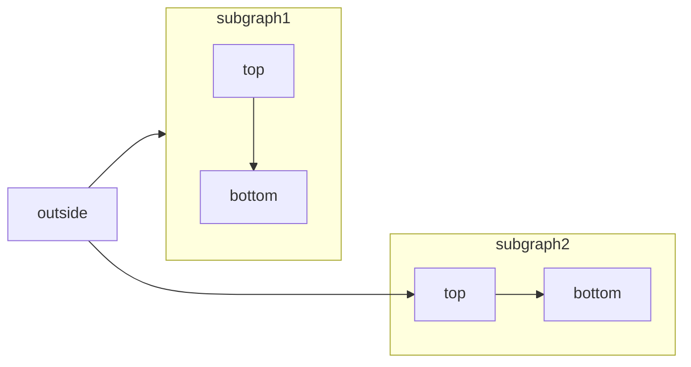

## Setting up

The first step to world-class documentation is setting up your editing environments.

<Icon icon="flag" iconType="solid" /> The documentation you want, effortlessly

<CardGroup cols={2}>
  <Card
    title="Edit Your Docs"
    icon="pen-to-square"
    href="https://mintlify.com/docs/quickstart"
  >
    Get your docs set up locally for easy development
  </Card>
  <Card
    title="Preview Changes"
    icon="image"
    href="https://mintlify.com/docs/development"
  >
    Preview your changes before you push to make sure they're perfect
  </Card>
</CardGroup>

## Make it yours

Update your docs to your brand and add valuable content for the best user conversion.

<CardGroup cols={2}>
  <Card
    title="Customize Style"
    icon="palette"
    href="https://mintlify.com/docs/settings/global"
  >
    Customize your docs to your company's colors and brands
  </Card>
  <Card
    title="Reference APIs"
    icon="code"
    href="https://mintlify.com/docs/api-playground/openapi"
  >
    Automatically generate endpoints from an OpenAPI spec
  </Card>
  <Card
    title="Add Components"
    icon="screwdriver-wrench"
    href="https://mintlify.com/docs/content/components/accordions"
  >
    Build interactive features and designs to guide your users
  </Card>
  <Card
    title="Get Inspiration"
    icon="stars"
    href="https://mintlify.com/customers"
  >
    Check out our showcase of our favorite documentation
  </Card>
</CardGroup>
